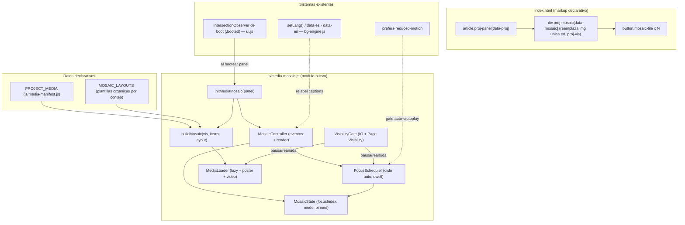
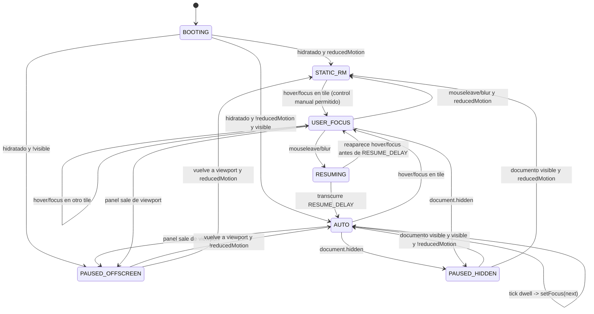
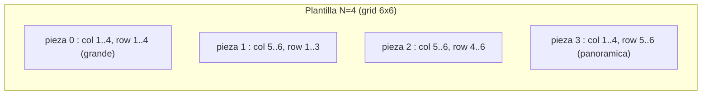

# Documento de Diseño: project-media-mosaic

## Overview
<!-- Resumen -->

Hoy cada `article.proj-panel` muestra **una sola imagen estática** dentro de `.proj-vis`
(``, `object-fit: cover`, `aspect-ratio: 4/3`). El tamaño percibido del
visual varía entre tarjetas: en paneles con mucho texto en `.proj-meta`, la columna de imagen de
`360px` se ve proporcionalmente pequeña; en otros, grande. Esta feature sustituye la imagen única por
un **mosaico orgánico y desordenado de medios mixtos** (imágenes, GIFs y vídeos) por proyecto y, de
paso, **reequilibra y agranda** el área visual para dar consistencia entre tarjetas.

El concepto es el **"Mosaico de Foco a la Deriva" (Focus-Drift Mosaic)**: todos los medios de un
proyecto conviven a la vez en una composición **asimétrica de tamaños variados** (no una rejilla
uniforme, no un carrusel). De forma autónoma, una pieza se vuelve la **enfocada**: se expande con una
transición suave para verse mejor, se mantiene un breve instante (*dwell*) y luego el foco **deriva**
a la siguiente pieza, recorriendo el mosaico en un ciclo continuo y de baja fricción. Si el usuario
pasa el cursor (o enfoca con teclado) sobre cualquier pieza, esa pieza pasa a ser la enfocada y el
ciclo automático **se pausa**; al salir, tras una breve gracia, el ciclo **se reanuda**. No hay flechas
ni controles intrusivos: el movimiento es ambiental hasta que el usuario decide tomar el control.

El diseño es **vanilla JS/CSS con mejora progresiva**, sin framework ni paso de build, coherente con la
arquitectura actual (`IntersectionObserver` de arranque `.booted`, sistema de idioma `data-es`/`data-en`,
tema `data-theme`, acento por proyecto `--proj-acc`, sistema de boot/compile). La expansión de foco usa
**solo transformaciones de compositor** (`transform`/`opacity`/`filter`) para garantizar 60 fps sin
reflow. Se respeta `prefers-reduced-motion` (sin auto-deriva ni autoplay) y se **pausa** la animación
cuando el panel está fuera de viewport o la pestaña está oculta. Los archivos son **placeholders**
declarados en un manifiesto de datos por proyecto, con convención de nombres clara para sustituirlos
por los reales más adelante.

---

## Architecture
<!-- Arquitectura -->



**Principios de integración**

- **Punto de enganche único:** el boot existente (`initVis(panel)` se llama tras añadir `.booted`)
  gana una llamada hermana `initMediaMosaic(panel)`. No se altera el flujo de `IntersectionObserver`;
  solo se extiende. No se toca la transición `.proj-panel.booted .proj-body { opacity: 1 }`.
- **Mejora progresiva:** el HTML contiene un mosaico estático y navegable (botones nativos). Sin JS, o
  ante error, el usuario ve y recorre todos los medios. `media-mosaic.js` "hidrata" añadiendo la deriva
  de foco y la carga perezosa.
- **Datos separados del comportamiento:** el manifiesto (`PROJECT_MEDIA`) y las plantillas de layout
  (`MOSAIC_LAYOUTS`) son datos puros; el módulo no contiene rutas, textos ni geometría hardcodeada.
- **Foco por transform, base por grid:** la composición orgánica base la resuelve CSS Grid (tamaños y
  posiciones variados, robusto y responsive); la **expansión de foco** se hace por `transform`/`opacity`
  (sin reflow), garantizando suavidad.

---

## Sequence Diagrams
<!-- Diagramas de secuencia -->

### Arranque e hidratación del mosaico (integrado con el boot existente)

```mermaid
sequenceDiagram
    participant IO as IntersectionObserver (ui.js)
    participant Panel as .proj-panel
    participant MM as media-mosaic.js
    participant Man as PROJECT_MEDIA / MOSAIC_LAYOUTS
    participant DOM as .proj-mosaic

    IO->>Panel: panel entra en viewport
    IO->>Panel: classList.add('booted'); initVis(panel)
    IO->>MM: initMediaMosaic(panel)
    MM->>Man: getManifest(proj) + getLayout(items.length)
    Man-->>MM: MediaItem[] + MosaicLayout
    MM->>DOM: buildMosaic(vis, items, layout)  (tiles + readout + aria-live)
    MM->>DOM: setFocus(0) (foco inicial determinista; carga item 0)
    MM->>MM: VisibilityGate.observe(panel) ; si visible -> Scheduler.start()
    Note over MM,DOM: mosaico interactivo; deriva de foco activa si visible y !reducedMotion
```

### Deriva automática del foco (tick del ciclo)

```mermaid
sequenceDiagram
    participant Sched as FocusScheduler
    participant State as MosaicState
    participant Ctrl as MosaicController
    participant Loader as MediaLoader

    loop mientras mode == AUTO y panel visible y !reducedMotion
        Sched->>Sched: esperar DWELL ms (timer)
        Sched->>State: nextIndex = (focusIndex + 1) mod N
        Sched->>Ctrl: setFocus(nextIndex, {source:'auto'})
        Ctrl->>State: focusIndex = nextIndex
        Ctrl->>Loader: ensureLoaded(item[next]) ; prefetch(item[next+1])
        Ctrl->>Loader: applyPlayback(tiles, focusIndex)  (play activo, pausa resto)
        Ctrl->>Ctrl: render() (clases is-focus/is-ambient + readout + aria-live)
    end
```

### Toma de control por el usuario (hover/focus) y reanudación

```mermaid
sequenceDiagram
    participant User as Usuario
    participant Tile as .mosaic-tile
    participant Ctrl as MosaicController
    participant Sched as FocusScheduler
    participant State as MosaicState

    User->>Tile: mouseenter / focus (idx)
    Tile->>Ctrl: onIntent(idx, 'hover'|'focus')
    Ctrl->>Sched: pause()                  // cancela timer de deriva
    Ctrl->>State: mode = USER ; focusIndex = idx
    Ctrl->>Ctrl: setFocus(idx, {source})   // expande la pieza elegida
    User->>Tile: mouseleave / blur
    Tile->>Ctrl: onRelease()
    Ctrl->>Sched: resumeAfter(RESUME_DELAY) // gracia antes de reanudar
    Note over Ctrl,Sched: si reaparece hover antes de RESUME_DELAY, se cancela la reanudacion
    Sched-->>Ctrl: (tras gracia) mode = AUTO ; continua deriva desde focusIndex
```

---

## Interaction State Machine
<!-- Maquina de estados de la interaccion -->

El comportamiento del mosaico se modela como una máquina de estados por panel. Las transiciones están
condicionadas (guards) por visibilidad del panel, visibilidad del documento y `prefers-reduced-motion`.



**Definición de estados**

| Estado | Significado | Deriva auto | Autoplay vídeo/GIF |
|---|---|---|---|
| `BOOTING` | aún no hidratado | no | no |
| `AUTO` | ciclo de foco a la deriva activo | sí (timer `DWELL`) | solo la pieza enfocada |
| `USER_FOCUS` | el usuario controla el foco (hover/teclado) | no (pausado) | solo la pieza enfocada |
| `RESUMING` | gracia tras soltar antes de volver a `AUTO` | no (cuenta atrás) | solo la pieza enfocada |
| `PAUSED_OFFSCREEN` | panel fuera de viewport | no | todo pausado |
| `PAUSED_HIDDEN` | pestaña/documento oculto | no | todo pausado |
| `STATIC_RM` | `prefers-reduced-motion`: sin deriva | no | no (póster estático); hover permitido |

**Invariantes de la máquina:**
- En todo estado, **exactamente una** pieza tiene clase `.is-focus`; el resto `.is-ambient`.
- La deriva automática solo avanza en estado `AUTO`.
- Nunca hay vídeo/GIF reproduciéndose en `PAUSED_OFFSCREEN`, `PAUSED_HIDDEN` ni `STATIC_RM`.
- `pinned` (click/Enter) eleva a una variante "fijada" de `USER_FOCUS` que ignora la reanudación
  automática hasta un nuevo click/Enter o un segundo clic sobre la misma pieza (toggle).

---

## Layout Strategy: el mosaico orgánico
<!-- Estrategia de composicion organica -->

El reto es un mosaico que **parezca desordenado y orgánico** (tamaños asimétricos, sin alineación de
rejilla obvia) pero que sea **determinista, robusto y responsive**. Se resuelve con **plantillas de
layout precomputadas por número de piezas**, expresadas como áreas de CSS Grid. Cada plantilla define
una rejilla densa (p. ej. 6 columnas × 6 filas) y asigna a cada pieza un rectángulo de tamaño distinto
mediante `grid-column`/`grid-row` con `span` variados. Esto produce una composición tipo *Voronoi/
ransom-note* sin solapamientos ni huecos, y sin depender de medidas en píxeles.



**Reglas de composición orgánica**

- **Tamaños variados:** cada plantilla mezcla al menos un *featured* (área grande), piezas medianas y
  alguna estrecha/panorámica, de modo que ninguna tarjeta tenga todas las piezas del mismo tamaño.
- **Asimetría espejada:** se reutiliza el patrón existente `:nth-child(even)` para **espejar** la
  plantilla en paneles pares (el área grande va al lado contrario), manteniendo coherencia con la
  alternancia actual de `.proj-vis`/`.proj-meta`.
- **Desorden controlado:** un ligero *jitter* visual opcional (`--tile-skew`, `--tile-shift` por pieza,
  derivado de su índice de forma determinista) rompe la sensación de rejilla sin afectar al hit-test.
  El jitter se desactiva en `prefers-reduced-motion` y en móvil.
- **Expansión de foco sin reflow:** la pieza enfocada **no cambia de celda**; se **eleva** visualmente
  con `transform: scale()` + `z-index` + sombra/acento, y las piezas ambientales se **atenúan**
  (`opacity`, `filter: saturate()/brightness()`) y reculan ligeramente. Así la expansión es un efecto
  de compositor (suave, 60 fps) y no un cambio de grid (que provocaría reflow de imágenes).

**Reequilibrio del área visual (objetivo del usuario)**

- Se **agranda y homogeneiza** el visual: `.proj-vis` pasa de `aspect-ratio: 4/3` a un objetivo más
  generoso y consistente (p. ej. `aspect-ratio: 5/4` con `min-height` mayor) y la columna del grid de
  `.proj-body` se amplía de `360px` a un valor mayor (token `--vis-col`, p. ej. `420–460px`). Esto se
  ajusta una sola vez en CSS para **todas** las tarjetas, eliminando la disparidad "unas grandes / otras
  pequeñas" que señala el usuario.
- En la pieza enfocada, `object-fit: cover` + un reencuadre suave (`object-position` animado o
  `transform-origin` hacia el centro de interés) permite "ver mejor" la imagen al expandirse.

---

## Components and Interfaces
<!-- Componentes e Interfaces -->

### Componente 1: Media Manifest (`js/media-manifest.js`)

**Propósito:** fuente de datos declarativa que asocia cada `data-proj` con su lista ordenada de medios.
Es el único lugar que el usuario edita para añadir/quitar archivos. (Compartible con specs hermanas si
ya existiera; este diseño asume que `media-mosaic.js` consume `getManifest`.)

```javascript
/**
 * @typedef {'image'|'gif'|'video'} MediaType
 *
 * @typedef {Object} MediaItem
 * @property {MediaType} type        - clase de medio
 * @property {string}    src         - ruta al archivo (placeholder por ahora)
 * @property {string}    [poster]    - poster/preview para 'video' (recomendado si type==='video')
 * @property {string}    [captionEs] - texto descriptivo en espanol
 * @property {string}    [captionEn] - texto descriptivo en ingles
 * @property {number}    [w]         - ancho intrinseco (opcional, evita layout shift)
 * @property {number}    [h]         - alto intrinseco (opcional)
 * @property {string}    [focus]     - object-position sugerido p. ej. '50% 30%' (centro de interes)
 *
 * @typedef {Object.<string, MediaItem[]>} MediaManifest  // clave = data-proj
 */

/** @type {MediaManifest} */
const PROJECT_MEDIA = { /* gw: [...], nltl: [...], ... */ };

/**
 * Devuelve la lista de medios de un proyecto, o [] si no existe.
 * @param {string} proj
 * @returns {MediaItem[]}
 */
function getManifest(proj) { /* ... */ }
```

**Responsabilidades:** mantener el orden de presentación (índice 0 = pieza enfocada inicial); garantizar
`type` y `src` válidos; no contener lógica de UI.

### Componente 2: Mosaic Layouts (`js/media-mosaic.js`, sección de datos)

**Propósito:** plantillas de composición orgánica por número de piezas. Datos puros (sin DOM).

```javascript
/**
 * Una celda de plantilla: rectangulo en una rejilla densa (cols x rows).
 * @typedef {Object} MosaicCell
 * @property {number} col   - linea de inicio de columna (1-based)
 * @property {number} colSpan
 * @property {number} row   - linea de inicio de fila (1-based)
 * @property {number} rowSpan
 * @property {boolean} [featured] - true para la(s) pieza(s) de mayor area
 *
 * @typedef {Object} MosaicLayout
 * @property {number} cols          - columnas de la rejilla densa (p. ej. 6)
 * @property {number} rows          - filas de la rejilla densa
 * @property {MosaicCell[]} cells   - una celda por pieza (cells.length === count)
 *
 * @typedef {Object.<number, MosaicLayout>} LayoutTable  // clave = numero de piezas (2..6)
 */

/** @type {LayoutTable} */
const MOSAIC_LAYOUTS = { /* 2:{...}, 3:{...}, 4:{...}, 5:{...}, 6:{...} */ };

/**
 * Devuelve la plantilla para n piezas. Para n fuera de rango usa la mas cercana
 * y, si n > max, reparte el excedente en celdas extra (fallback determinista).
 * @param {number} n
 * @returns {MosaicLayout}
 */
function getLayout(n) { /* ... */ }
```

**Responsabilidades:** ofrecer una composición asimétrica válida (sin solapes, cubre la rejilla) para
cada `n`; ser el único lugar donde vive la geometría del mosaico.

### Componente 3: Media Mosaic (`js/media-mosaic.js`)

**Propósito:** hidratar `.proj-vis` → `.proj-mosaic`, construir tiles, gestionar estado, el ciclo de
deriva y la interacción.

```javascript
/**
 * Hidrata el mosaico de un panel concreto. Idempotente.
 * @param {HTMLElement} panel - article.proj-panel
 * @returns {MosaicController|null} null si el panel no tiene medios
 */
function initMediaMosaic(panel) { /* ... */ }

/**
 * @typedef {'AUTO'|'USER_FOCUS'|'RESUMING'|'PAUSED_OFFSCREEN'|'PAUSED_HIDDEN'|'STATIC_RM'} MosaicMode
 *
 * @typedef {Object} MosaicController
 * @property {(i:number, opts?:{source?:'auto'|'hover'|'focus'|'key'|'click'|'init', pinned?:boolean})=>void} setFocus
 * @property {()=>number} getFocus
 * @property {()=>void} next          // foco -> siguiente (wrap)
 * @property {()=>void} prev          // foco -> anterior (wrap)
 * @property {()=>void} pause         // detiene la deriva (entra en USER_FOCUS/manual)
 * @property {()=>void} resume        // reanuda la deriva (vuelve a AUTO si procede)
 * @property {()=>MosaicMode} getMode
 * @property {()=>void} relabel       // re-renderiza captions/aria tras cambio de idioma
 * @property {()=>void} destroy       // desconecta observers/timers/listeners
 */
```

**Responsabilidades:** construir el DOM del mosaico desde `MediaItem[]` + `MosaicLayout`; gestionar
`MosaicState` y la máquina de estados; coordinar el `FocusScheduler`, la carga perezosa y la
reproducción condicionada; exponer `relabel()` para el cambio de idioma; limpiar todo en `destroy()`.

### Componente 4: Focus Scheduler (interno a `media-mosaic.js`)

**Propósito:** temporizar la deriva automática del foco con *dwell* y reanudación con gracia.

```javascript
/**
 * @typedef {Object} FocusScheduler
 * @property {()=>void} start                 // arranca el ciclo (no-op si ya activo o RM)
 * @property {()=>void} pause                 // cancela el timer de deriva
 * @property {(ms:number)=>void} resumeAfter  // reanuda tras ms (cancelable)
 * @property {()=>boolean} isRunning
 * @property {()=>void} dispose
 */

/** Crea el scheduler ligado a un controller. */
function createFocusScheduler(ctrl, opts) { /* opts: {dwell, resumeDelay, getReducedMotion} */ }
```

**Responsabilidades:** un único `setTimeout` activo por mosaico (no `setInterval`, para encadenar tras
cada transición); cancelación limpia en pausa/destroy; respetar `prefers-reduced-motion` (nunca arranca).

### Componente 5: Visibility Gate (interno a `media-mosaic.js`)

**Propósito:** unificar `IntersectionObserver` (panel on/off screen) + Page Visibility API (pestaña
oculta) para pausar/reanudar scheduler y reproducción.

```javascript
/**
 * @typedef {Object} VisibilityGate
 * @property {()=>boolean} isPanelVisible
 * @property {()=>boolean} isDocVisible
 * @property {()=>void} dispose
 */

/** Observa el panel y el documento; invoca onChange(visible:boolean) en cada cambio. */
function createVisibilityGate(panel, onChange) { /* ... */ }
```

**Responsabilidades:** emitir `onChange(true|false)` donde `visible = isPanelVisible && isDocVisible`;
reutilizar la misma disciplina que `runRender()` de `initVis` (pausa offscreen).

### Componente 6: Media Loader (interno a `media-mosaic.js`)

**Propósito:** cargar perezosamente cada medio, prefetch del siguiente y aplicar la política de
reproducción.

```javascript
/**
 * Carga el medio de un tile si aun no se cargo (idempotente).
 * @param {HTMLElement} tile
 * @param {MediaItem} item
 * @returns {Promise<void>}
 */
function ensureLoaded(tile, item) { /* ... */ }

/**
 * Reproduce video/GIF solo si el tile esta enfocado y reducedMotion no esta activo.
 * Pausa/segura el resto.
 * @param {HTMLElement} tile
 * @param {MediaItem} item
 * @param {boolean} isFocus
 * @param {boolean} reducedMotion
 */
function applyPlayback(tile, item, isFocus, reducedMotion) { /* ... */ }
```

**Responsabilidades:** insertar `` o `<video preload="none" muted playsinline>` bajo
demanda; diferir el `src` de GIF hasta enfoque (los GIF animan al cargar); pausar vídeos no enfocados;
fallback ante 404 (`.media-error`).

---

## Data Models
<!-- Modelos de Datos -->

### Modelo: MediaItem y manifiesto (placeholders actuales)

```javascript
// js/media-manifest.js
const PROJECT_MEDIA = {
  gw: [
    { type: 'image', src: 'public/ph_gw.png',          captionEs: 'Vista general',      captionEn: 'Overview',      focus: '50% 40%' },
    { type: 'image', src: 'public/media/gw/gw-02.png', captionEs: 'Grad-CAM',           captionEn: 'Grad-CAM' },
    { type: 'gif',   src: 'public/media/gw/gw-03.gif', captionEs: 'Inferencia en vivo', captionEn: 'Live inference' },
    { type: 'video', src: 'public/media/gw/gw-04.mp4',
      poster: 'public/media/gw/gw-04.poster.png',      captionEs: 'Demo de la UI web',  captionEn: 'Web UI demo' }
  ],
  nltl:     [ /* nltl-02.png, nltl-03.png, nltl-04.gif + ph_nltl.png */ ],
  cosmos:   [ /* cosmos-02.png, cosmos-03.png, cosmos-04.mp4 (+poster) + ph_cosmos.png */ ],
  physdeck: [ /* physdeck-02.png, physdeck-03.png, physdeck-04.gif + ph_physdeck.png */ ],
  mineralia:[ /* mineralia-02.png, mineralia-03.png, mineralia-04.gif + ph_mineralia.png */ ],
  mario:    [ /* mario-02.png, mario-03.png, mario-04.gif + ph_mario.png */ ]
};
```

**Convención de nombres (placeholders → reales):**

```
public/media/{proj}/{proj}-{NN}.{ext}        // imagenes y gifs:  gw-02.png, gw-03.gif
public/media/{proj}/{proj}-{NN}.mp4          // video
public/media/{proj}/{proj}-{NN}.poster.png   // poster del video
```

`{proj}` ∈ `{gw, nltl, cosmos, physdeck, mineralia, mario}`; `{NN}` índice de 2 dígitos. El índice 0 del
array es la pieza enfocada inicial. Mientras no haya archivos reales para algún slot, se reutiliza el
`public/ph_{proj}.png` correspondiente como relleno, de modo que el mosaico sea visible de inmediato.

**Reglas de validación:**
- `type` ∈ {`image`,`gif`,`video`}; obligatorio. `src` no vacío; obligatorio.
- Si `type === 'video'` ⇒ `poster` recomendado (si falta, fondo HUD + acento).
- Un proyecto puede tener entre 1 y N medios. Con 1 medio, el mosaico degrada a vista única (sin deriva).
- `captionEs`/`captionEn` opcionales; si faltan se usa `alt` genérico `"{proj} · {NN}"`.
- `focus` opcional; si falta, `object-position: center`.

### Modelo: MosaicState (en memoria, por panel)

```javascript
/**
 * @typedef {Object} MosaicState
 * @property {MediaItem[]} items
 * @property {MosaicLayout} layout
 * @property {number}  focusIndex    // 0..items.length-1 ; pieza enfocada/expandida
 * @property {MosaicMode} mode       // ver maquina de estados
 * @property {boolean} pinned        // true si el usuario fijo con click/Enter
 * @property {boolean} reducedMotion // snapshot de la media query (reactivo)
 * @property {boolean} panelVisible  // del IntersectionObserver
 * @property {boolean} docVisible    // de Page Visibility
 */
```

**Invariantes de estado:**
- `0 ≤ focusIndex < items.length` en todo momento.
- `items.length ≥ 1` (si el manifiesto está vacío, no se hidrata).
- Exactamente **una** tile tiene `.is-focus`; el resto `.is-ambient`.
- `mode === 'AUTO'` ⇒ `panelVisible ∧ docVisible ∧ ¬reducedMotion ∧ ¬pinned`.
- Hay como máximo **un** medio (vídeo/GIF) reproduciéndose, y solo puede ser el de `focusIndex`.

### Modelo: constantes de tiempo (única fuente de verdad)

```javascript
const MOSAIC_TIMING = Object.freeze({
  DWELL:        3200,  // ms que una pieza permanece enfocada antes de derivar
  FOCUS_TRANS:   520,  // ms de la transicion de expansion (coincide con CSS)
  RESUME_DELAY:  900,  // ms de gracia tras mouseleave antes de reanudar AUTO
  STAGGER:        70   // ms de escalonado al construir tiles (entrada)
});
```

**Invariante de tiempo:** `FOCUS_TRANS < DWELL` (la transición termina antes del siguiente tick) y
`RESUME_DELAY > 0`.

---

## Estructura HTML (markup base, mejora progresiva)

El `` único de cada `.proj-vis` se sustituye por un contenedor `.proj-mosaic` con un `<button>` por
pieza. Sin JS, los botones muestran un mosaico estático navegable por teclado. Ejemplo para `gw`:

```html
<div class="proj-vis">
  <div class="proj-mosaic" data-mosaic data-count="4"
       role="group" aria-label="Galeria del proyecto" aria-roledescription="mosaico de medios">
    <!-- Pieza 0 = enfocada inicial. data-cell la posiciona en la rejilla densa. -->
    <button class="mosaic-tile is-focus" type="button" data-idx="0" data-type="image"
            aria-pressed="true" style="--col:1;--col-span:4;--row:1;--row-span:4;">
      
    </button>
    <button class="mosaic-tile is-ambient" type="button" data-idx="1" data-type="image"
            aria-pressed="false" style="--col:5;--col-span:2;--row:1;--row-span:3;">
      
    </button>
    <button class="mosaic-tile is-ambient" type="button" data-idx="2" data-type="gif"
            aria-pressed="false" style="--col:5;--col-span:2;--row:4;--row-span:3;">
      
    </button>
    <button class="mosaic-tile is-ambient" type="button" data-idx="3" data-type="video"
            aria-pressed="false" style="--col:1;--col-span:4;--row:5;--row-span:2;">
      <!-- el <video> se inyecta al enfocar; mientras tanto, poster como  -->
      
      <span class="mosaic-badge" aria-hidden="true">▶ VID</span>
    </button>
  </div>
  <!-- Lector HUD: indice + tipo (reutiliza lenguaje .vis-label/.vis-channel) -->
  <div class="mosaic-readout" aria-hidden="true">
    <span class="mo-idx">01</span><span class="mo-sep">/</span><span class="mo-total">04</span>
    <span class="mo-type">IMG</span>
  </div>
  <!-- Indicador de modo (auto/pausa) y region viva para lectores de pantalla -->
  <span class="mosaic-modedot" aria-hidden="true" data-mode="auto"></span>
  <p class="mosaic-live sr-only" aria-live="polite"></p>
</div>
```

**Notas de markup:**
- Cada pieza es `<button>`: foco e interacción por teclado nativos; `aria-pressed` marca la enfocada.
- La geometría se inyecta como **custom properties por pieza** (`--col`, `--col-span`, `--row`,
  `--row-span`) desde `MosaicLayout` (las escribe `buildMosaic`). Así CSS no necesita selectores por
  índice y el layout es puramente data-driven.
- El `` enfocado carga con `src`; los ambientales usan `data-src` (lazy) y se promueven al cargar.
- Se mantienen el esquinero `.proj-vis::after` y el acento `--proj-acc`. La clase `.sr-only` se añade si
  no existe.

---

## Enfoque CSS
<!-- Estructura y clases CSS -->

```css
/* === Reequilibrio del area visual (afecta a TODAS las tarjetas, objetivo del usuario) === */
:root { --vis-col: 440px; }                 /* antes 360px */
.proj-body { grid-template-columns: var(--vis-col) 1fr; }
.proj-vis  { aspect-ratio: 5 / 4; min-height: 260px; }   /* antes 4/3, 200px */

/* === Mosaico: rejilla densa organica === */
.proj-mosaic {
  position: absolute; inset: 0; z-index: 1;
  display: grid; gap: 3px; padding: 3px;
  grid-template-columns: repeat(6, 1fr);
  grid-template-rows: repeat(6, 1fr);
  isolation: isolate;                        /* z-index del foco local al mosaico */
}

/* Cada pieza se posiciona con las custom properties inyectadas por buildMosaic */
.mosaic-tile {
  position: relative; overflow: hidden; border: 0; padding: 0; cursor: pointer;
  background: color-mix(in oklab, var(--bg-3, #1f2330) 70%, var(--bg));
  grid-column: var(--col) / span var(--col-span);
  grid-row:    var(--row) / span var(--row-span);
  /* desorden controlado: jitter determinista por pieza (lo fija JS via --skew/--shift) */
  transform: rotate(var(--skew, 0deg)) translate(var(--shift, 0px), 0);
  transition: transform var(--focus-trans, .52s) cubic-bezier(.2,.7,.2,1),
              opacity   .4s ease, filter .4s ease, box-shadow .4s ease;
  outline-offset: -2px; will-change: transform, opacity;
}
.mosaic-tile .mosaic-media {
  width: 100%; height: 100%; object-fit: cover;
  object-position: var(--focus-pos, center);
  opacity: 0; transition: opacity .45s ease, transform .6s cubic-bezier(.2,.7,.2,1);
}
.mosaic-tile .mosaic-media.loaded { opacity: 1; }

/* Pieza enfocada: se ELEVA por compositor (sin reflow): escala + z + acento */
.mosaic-tile.is-focus {
  z-index: 5;
  transform: scale(1.06) rotate(0deg);       /* anula el jitter al enfocar */
  box-shadow: 0 6px 26px color-mix(in oklab, var(--proj-acc, var(--accent)) 35%, transparent),
              inset 0 0 0 1px color-mix(in oklab, var(--proj-acc, var(--accent)) 60%, transparent);
}
.mosaic-tile.is-focus .mosaic-media { transform: scale(1.04); }  /* leve zoom para "ver mejor" */

/* Piezas ambientales: atenuadas, ceden protagonismo */
.mosaic-tile.is-ambient { opacity: .82; filter: saturate(.85) brightness(.9); }
.proj-mosaic:hover .mosaic-tile.is-ambient { opacity: .7; }

/* Barrido tipo CRT al cambiar de foco (gancho .drifting, breve) */
.mosaic-tile.is-focus.just-focused::before {
  content: ""; position: absolute; inset: 0; z-index: 3; pointer-events: none;
  background: linear-gradient(90deg, transparent,
              color-mix(in oklab, var(--proj-acc, var(--accent)) 30%, transparent), transparent);
  animation: mosaic-sweep .5s ease;
}
@keyframes mosaic-sweep { from { transform: translateX(-100%);} to { transform: translateX(120%);} }

/* Badge de tipo para video/gif */
.mosaic-badge {
  position: absolute; left: 8px; bottom: 8px; z-index: 4;
  font-family: var(--mono); font-size: 9px; letter-spacing: .08em;
  color: var(--proj-acc, var(--accent)); padding: 1px 5px;
  background: color-mix(in oklab, var(--bg) 55%, transparent); border-radius: 2px;
}

/* HUD readout + indicador de modo */
.mosaic-readout {
  position: absolute; right: 10px; bottom: 8px; z-index: 6; pointer-events: none;
  font-family: var(--mono); font-size: 9.5px; letter-spacing: .06em;
  color: var(--proj-acc, var(--accent)); opacity: .85;
}
.mosaic-modedot {
  position: absolute; right: 10px; top: 8px; z-index: 6; width: 6px; height: 6px; border-radius: 50%;
  background: var(--proj-acc, var(--accent));
}
.mosaic-modedot[data-mode="auto"]  { animation: mo-pulse 2s ease-in-out infinite; }
.mosaic-modedot[data-mode="user"]  { animation: none; opacity: .5; }   /* pausado por el usuario */
@keyframes mo-pulse { 0%,100%{opacity:.4} 50%{opacity:1} }

/* Foco visible accesible */
.mosaic-tile:focus-visible { outline: 1px solid var(--proj-acc, var(--accent)); z-index: 6; }

/* Layout espejado en paneles pares (coherente con el patron existente) */
.proj-panel:nth-child(even) .proj-mosaic { transform: scaleX(-1); }
.proj-panel:nth-child(even) .proj-mosaic .mosaic-media,
.proj-panel:nth-child(even) .proj-mosaic .mosaic-badge,
.proj-panel:nth-child(even) .proj-mosaic .mosaic-readout { transform: scaleX(-1); } /* des-espeja contenido */

/* === Responsive: bajo 900px, tira con scroll-snap (gesto natural, cero friccion tactil) === */
@media (max-width: 900px) {
  .proj-vis { aspect-ratio: 16/9; min-height: 0; }
  .proj-mosaic {
    position: relative; grid-template-columns: none; grid-template-rows: none;
    grid-auto-flow: column; grid-auto-columns: 78%;
    overflow-x: auto; scroll-snap-type: x mandatory; -webkit-overflow-scrolling: touch;
  }
  .mosaic-tile { grid-column: auto !important; grid-row: auto !important;
                 transform: none !important; scroll-snap-align: center; }
  .mosaic-tile.is-focus { transform: none !important; box-shadow: none; }
  .proj-panel:nth-child(even) .proj-mosaic { transform: none; }
}

/* === Reduced motion: sin deriva, sin barrido, sin escala, sin jitter (JS ademas no arranca) === */
@media (prefers-reduced-motion: reduce) {
  .mosaic-tile, .mosaic-media { transition: none; transform: none !important; }
  .mosaic-tile.is-focus { transform: none !important; }
  .mosaic-tile.is-focus.just-focused::before { animation: none; }
  .mosaic-modedot { animation: none; }
}
```

**Decisiones de diseño CSS:**
- **Grid denso 6×6 + spans** crea la composición orgánica/asimétrica sin píxeles ni solapes, y es
  data-driven (custom properties por pieza), evitando selectores por índice.
- **Foco por `transform`/`opacity`/`filter`** (no por cambio de celda) ⇒ animación de compositor, 60 fps,
  sin reflow de imágenes pesadas. Cumple el objetivo "expandir para ver mejor" con leve zoom de imagen.
- **Espejado por `scaleX(-1)`** reutiliza el espíritu del `:nth-child(even)` actual y des-espeja el
  contenido para que las imágenes/textos no salgan invertidos.
- **Móvil → tira con `scroll-snap`**: navegación por desplazamiento directo, sin flechas (no es carrusel),
  cero fricción táctil; se desactivan transform/jitter para rendimiento.

---

## Pseudocódigo algorítmico (con especificaciones formales)
<!-- Algoritmos clave -->

### Algoritmo: initMediaMosaic

```javascript
function initMediaMosaic(panel)
// ENTRADA: panel — HTMLElement article.proj-panel
// SALIDA: MosaicController | null
```

**Precondiciones:** `panel != null` y contiene `.proj-vis`; `PROJECT_MEDIA` y `MOSAIC_LAYOUTS` cargados.

**Postcondiciones:**
- Si el proyecto tiene ≥1 medio: `.proj-vis` contiene un `.proj-mosaic` hidratado con exactamente una
  tile `.is-focus`; se devuelve un `MosaicController`. Si hay ≥2 y `¬reducedMotion` y el panel es
  visible, el scheduler queda en marcha (`mode === 'AUTO'`).
- Si no hay medios: no se modifica el DOM; devuelve `null`.
- Idempotente: invocar k≥1 veces no duplica tiles, timers ni listeners.

```javascript
function initMediaMosaic(panel) {
  ASSERT panel != null
  const proj  = panel.dataset.proj
  const items = getManifest(proj)
  IF items.length === 0 THEN return null

  const vis = panel.querySelector('.proj-vis')
  IF vis.dataset.mosaicReady === '1' THEN return vis.__mosaicCtrl     // idempotencia

  const layout = getLayout(items.length)
  const dom    = buildMosaic(vis, items, layout)   // tiles + geometria + readout + aria-live
  const state  = {
    items, layout, focusIndex: 0, mode: 'BOOTING', pinned: false,
    reducedMotion: matchMedia('(prefers-reduced-motion: reduce)').matches,
    panelVisible: false, docVisible: !document.hidden
  }

  const ctrl = createController(panel, dom, state)         // expone setFocus/next/prev/...
  const sched = createFocusScheduler(ctrl, {
    dwell: MOSAIC_TIMING.DWELL, resumeDelay: MOSAIC_TIMING.RESUME_DELAY,
    getReducedMotion: () => state.reducedMotion
  })
  const gate = createVisibilityGate(panel, (visible) => ctrl._onVisibility(visible))

  ctrl._bind(sched, gate)            // cablea eventos hover/focus/click/keydown + reactividad RM
  ctrl.setFocus(0, { source: 'init' })   // foco inicial determinista; carga item 0 + prefetch 1
  ctrl._onVisibility(gate.isPanelVisible() && gate.isDocVisible())  // arranca AUTO si procede

  vis.dataset.mosaicReady = '1'; vis.__mosaicCtrl = ctrl
  return ctrl
}
```

**Invariantes de bucle:** N/A (construcción delegada en `buildMosaic`).

### Algoritmo: setFocus (núcleo de la interacción)

```javascript
function setFocus(i, opts)
// ENTRADA: i — indice solicitado; opts.{source?, pinned?}
// SALIDA: void (efecto sobre DOM y state)
```

**Precondiciones:** `state.items.length ≥ 1`; `i` entero (puede venir fuera de rango → se normaliza).

**Postcondiciones:**
- `state.focusIndex === normalize(i)` con `0 ≤ focusIndex < items.length`.
- Exactamente una tile con `.is-focus`; su medio está cargado o cargándose; el siguiente se prefetch-ea.
- Vídeo/GIF enfocado reproduce **sii** `¬reducedMotion ∧ visible`; el resto pausado.
- Readout HUD y región `aria-live` reflejan índice y tipo.
- Si `opts.source === 'auto'` y `state.mode !== 'AUTO'`, se ignora (un tick rezagado no pisa al usuario).
- Si `opts.source ∈ {hover,focus}` ⇒ `mode = USER_FOCUS` y scheduler pausado.

```javascript
function setFocus(i, opts = {}) {
  ASSERT state.items.length >= 1

  // 1. Un tick AUTO rezagado nunca pisa el control del usuario
  IF opts.source === 'auto' AND state.mode !== 'AUTO' THEN return

  // 2. Normalizar con wrap (teclado/auto next/prev)
  const n = state.items.length
  const idx = ((i % n) + n) % n
  const prev = state.focusIndex
  state.focusIndex = idx

  // 3. Transicion de modo segun origen
  IF opts.source === 'hover' OR opts.source === 'focus' THEN
    state.mode = 'USER_FOCUS' ; scheduler.pause()
  IF opts.source === 'click' THEN
    state.pinned = (prev === idx) ? !state.pinned : true
    state.mode = 'USER_FOCUS' ; scheduler.pause()

  // 4. Reflejar en DOM (invariante: un solo foco)
  FOR each tile, k IN dom.tiles DO
    const isFocus = (k === idx)
    tile.classList.toggle('is-focus',   isFocus)
    tile.classList.toggle('is-ambient', !isFocus)
    tile.setAttribute('aria-pressed', String(isFocus))
  END FOR
  INVARIANT: count(tiles with .is-focus) === 1

  // 5. Aplicar object-position de interes + barrido CRT breve
  applyFocusPos(dom.tiles[idx], state.items[idx].focus)
  IF prev !== idx AND !state.reducedMotion THEN flashSweep(dom.tiles[idx])  // add/remove .just-focused

  // 6. Cargar enfocado + prefetch siguiente; politica de reproduccion
  ensureLoaded(dom.tiles[idx], state.items[idx])
  ensureLoaded(dom.tiles[(idx + 1) % n], state.items[(idx + 1) % n])        // prefetch
  const visible = state.panelVisible AND state.docVisible
  FOR each tile, k IN dom.tiles DO
    applyPlayback(tile, state.items[k], k === idx && visible, state.reducedMotion)
  END FOR

  // 7. HUD + accesibilidad
  updateReadout(dom, idx, state.items[idx].type)
  setModeDot(dom, state.mode)
  announce(dom, idx, state.items[idx])     // aria-live polite
}
```

**Invariantes de bucle:**
- Tras el paso 4, el número de tiles con `.is-focus` es exactamente 1.
- Tras el paso 6, todo tile distinto del enfocado queda pausado/seguro.

### Algoritmo: ciclo de deriva (FocusScheduler)

```javascript
function scheduleNextDrift()
// Encadena un unico setTimeout; nunca usa setInterval.
```

**Precondiciones:** controller inicializado.

**Postcondiciones:** si al expirar `DWELL` el `mode` sigue siendo `AUTO`, se avanza el foco en +1 (wrap);
en otro caso, no se hace nada (el timer no se re-arma hasta volver a `AUTO`).

```javascript
function start() {                          // FocusScheduler.start
  IF reducedMotion() THEN return            // nunca arranca con reduced motion
  IF items.length < 2 THEN return           // 1 medio: nada que derivar
  IF running THEN return
  running = true
  armTimer()
}
function armTimer() {
  clearTimeout(timer)
  timer = setTimeout(() => {
    IF ctrl.getMode() === 'AUTO' THEN
      ctrl.setFocus(ctrl.getFocus() + 1, { source: 'auto' })   // expande -> mantiene -> deriva
    armTimer()                              // re-encadena el siguiente dwell
  }, DWELL)
}
function pause() { running = false; clearTimeout(timer); clearTimeout(resumeTimer) }
function resumeAfter(ms) {
  clearTimeout(resumeTimer)
  resumeTimer = setTimeout(() => {
    IF ctrl.canAuto() THEN { ctrl._setMode('AUTO'); start() }   // canAuto: visible && !RM && !pinned
  }, ms)
}
```

**Invariantes de bucle:**
- Hay **a lo sumo un** timer de deriva activo (re-encadenado, no acumulado).
- La deriva solo modifica el foco cuando `mode === 'AUTO'` en el momento del disparo.

### Algoritmo: gestión de visibilidad (VisibilityGate → controller)

```javascript
function _onVisibility(visible)
// visible = panelVisible && docVisible
```

**Postcondiciones:**
- Si `visible` y `¬reducedMotion` y `¬pinned` ⇒ `mode = AUTO` y `scheduler.start()`.
- Si `¬visible` ⇒ `mode ∈ {PAUSED_OFFSCREEN, PAUSED_HIDDEN}`, `scheduler.pause()` y **todo** medio se
  pausa (`applyPlayback(..., isFocus=false)` en todos).

```javascript
function _onVisibility(visible) {
  state.panelVisible = gate.isPanelVisible()
  state.docVisible   = gate.isDocVisible()
  IF NOT visible THEN
    state.mode = state.docVisible ? 'PAUSED_OFFSCREEN' : 'PAUSED_HIDDEN'
    scheduler.pause()
    pauseAllMedia()                          // ningun video/gif sigue corriendo offscreen
  ELSE
    IF state.reducedMotion THEN state.mode = 'STATIC_RM'
    ELSE IF state.pinned     THEN state.mode = 'USER_FOCUS'
    ELSE { state.mode = 'AUTO'; scheduler.start() }
    applyPlayback(dom.tiles[state.focusIndex], state.items[state.focusIndex], !state.reducedMotion, state.reducedMotion)
  setModeDot(dom, state.mode)
}
```

### Algoritmo: ensureLoaded (carga perezosa)

```javascript
function ensureLoaded(tile, item) // -> Promise<void>
```

**Precondiciones:** `tile` existe; `item.type ∈ {image,gif,video}`; `item.src` no vacío.

**Postcondiciones:** el elemento de medio correcto existe con su `src` real; idempotente vía
`tile.dataset.loaded`; no lanza ante 404 (aplica `.media-error`).

```javascript
function ensureLoaded(tile, item) {
  IF tile.dataset.loaded === '1' THEN return Promise.resolve()
  SWITCH item.type
    CASE 'image':
    CASE 'gif':
      const img = tile.querySelector('img.mosaic-media')
      img.src = img.dataset.src || item.src        // promueve data-src -> src
      onload  -> img.classList.add('loaded')
      onerror -> tile.classList.add('media-error')
    CASE 'video':
      // se conserva el  poster; el <video> se inyecta y reproduce solo al enfocar
      const v = ensureVideoEl(tile, { muted:true, playsinline:true, loop:true,
                                      preload:'none', poster:item.poster })
      v.src = item.src
      v.addEventListener('loadeddata', () => tile.classList.add('video-ready'), { once:true })
      onerror -> tile.classList.add('media-error')
  END SWITCH
  tile.dataset.loaded = '1'
  return loadedPromise
}
```

### Algoritmo: applyPlayback (política de reproducción)

```javascript
function applyPlayback(tile, item, shouldPlay, reducedMotion)
// shouldPlay = isFocus && panelVisible && docVisible
```

**Postcondiciones:**
- `video`: reproduce sii `shouldPlay ∧ ¬reducedMotion`; en otro caso `pause()` (queda póster).
- `gif`: si `shouldPlay ∧ ¬reducedMotion`, asegura carga (anima); si no, no promueve `data-src` (primer
  frame/estático).
- `image`: sin efecto.

```javascript
function applyPlayback(tile, item, shouldPlay, reducedMotion) {
  IF item.type === 'video' THEN
    const v = tile.querySelector('video'); IF v == null THEN return
    IF shouldPlay AND NOT reducedMotion THEN v.play().catch(noop) ELSE v.pause()
  ELSE IF item.type === 'gif' THEN
    IF shouldPlay AND NOT reducedMotion THEN ensureLoaded(tile, item)
}
```

---

## Funciones clave con especificaciones formales
<!-- Resumen de firmas y contratos -->

| Función | Firma | Precondición | Postcondición |
|---|---|---|---|
| `getManifest` | `(proj:string) => MediaItem[]` | `proj` es string | array (posible vacío); nunca null |
| `getLayout` | `(n:number) => MosaicLayout` | `n ≥ 1` | plantilla con `cells.length === n`; sin solapes |
| `buildMosaic` | `(vis, items, layout) => MosaicDom` | `items.length ≥ 1` | N tiles con geometría + readout + aria-live; tile 0 `.is-focus` |
| `initMediaMosaic` | `(panel) => MosaicController\|null` | panel con `.proj-vis` | hidratado e idempotente, o null sin medios |
| `setFocus` | `(i:number, opts?) => void` | `items.length ≥ 1` | exactamente un foco; índice en rango; playback correcto |
| `next`/`prev` | `() => void` | inicializado | foco ±1 con wrap; entra en control de usuario |
| `scheduleNextDrift` | `() => void` (interno) | scheduler activo | avanza foco sii `mode==='AUTO'`; un solo timer |
| `_onVisibility` | `(visible:boolean) => void` | gate inicializado | pausa offscreen/hidden; reanuda AUTO si procede |
| `ensureLoaded` | `(tile, item) => Promise<void>` | item válido | medio cargado una sola vez; fallback ante error |
| `applyPlayback` | `(tile, item, shouldPlay, RM) => void` | RM booleano | play sii enfocado+visible+¬RM; resto pausado |
| `relabel` | `() => void` | inicializado | captions/aria según `documentElement.dataset.lang` |
| `destroy` | `() => void` | — | timers/observers/listeners liberados; sin fugas |

---

## Ejemplo de uso
<!-- Integracion concreta -->

```javascript
// 1) En ui.js, dentro del IntersectionObserver de boot ya existente:
const pio = new IntersectionObserver(entries => entries.forEach(e => {
  if (!e.isIntersecting) return;
  const panel = e.target;
  const fill = panel.querySelector('.proj-boot-fill');
  if (fill) requestAnimationFrame(() => { fill.style.width = '100%'; });
  setTimeout(() => {
    panel.classList.add('booted');
    initVis(panel);
    initMediaMosaic(panel);        // ← NUEVO: hidrata el mosaico al bootear el panel
  }, 440);
  pio.unobserve(panel);
}), { threshold: 0, rootMargin: '0px 0px -10% 0px' });

// 2) Al cambiar de idioma (en setLang de bg-engine.js), re-etiquetar los mosaicos:
document.querySelectorAll('.proj-vis').forEach(v => v.__mosaicCtrl?.relabel());

// 3) Interaccion declarativa (delegacion dentro de cada .proj-mosaic):
//    mouseenter/focus en tile -> setFocus(idx, {source:'hover'|'focus'})  (pausa la deriva)
//    mouseleave/blur del mosaico -> scheduler.resumeAfter(RESUME_DELAY)    (reanuda con gracia)
//    click/Enter en tile        -> setFocus(idx, {source:'click'})         (fija/des-fija pin)
//    ArrowRight/ArrowLeft       -> ctrl.next() / ctrl.prev()               (wrap, control usuario)

// 4) Carga de scripts (index.html): el manifiesto antes que el modulo
//    <script defer src="js/media-manifest.js"></script>
//    <script defer src="js/media-mosaic.js"></script>
//    <script defer src="js/ui.js"></script>
```

---

## Correctness Properties
<!-- Propiedades de Correctitud -->

Para todo panel `p` con manifiesto `items` (|items| ≥ 1), layout `L = getLayout(|items|)` y toda
secuencia de interacciones y ticks:

### Property 1: Exactamente un foco
∀ estado alcanzable, `count({ t ∈ tiles(p) : t tiene .is-focus }) = 1`.

**Validates: Requirements 1.2**

### Property 2: Índice en rango
∀ estado, `0 ≤ focusIndex < |items|` (incluido tras `next`/`prev`/deriva con wrap).

**Validates: Requirements 2.3**

### Property 3: Wrap correcto
`next()` en `focusIndex = |items|−1` ⇒ `0`; `prev()` en `0` ⇒ `|items|−1`; la deriva auto avanza +1 mod N.

**Validates: Requirements 2.2, 3.2, 3.3**

### Property 4: Deriva solo en AUTO
La deriva automática cambia `focusIndex` **solo** cuando `mode === 'AUTO'` en el instante del tick; un
tick `source:'auto'` con `mode ≠ 'AUTO'` es no-op.

**Validates: Requirements 2.4**

### Property 5: Hover/teclado pausa la deriva
Tras un evento `hover`/`focus`/`key`/`click`, `mode = 'USER_FOCUS'` (o fijado) y no hay deriva hasta que
`resumeAfter` la reanude (estando `visible ∧ ¬RM ∧ ¬pinned`).

**Validates: Requirements 3.1, 3.6**

### Property 6: Reanudación con gracia, cancelable
Si tras `mouseleave` reaparece `hover`/`focus` antes de `RESUME_DELAY`, no se vuelve a `AUTO` (la
reanudación pendiente se cancela).

**Validates: Requirements 3.4, 3.5, 3.7**

### Property 7: Un único medio en reproducción
∀ estado, a lo sumo un medio (vídeo/GIF) reproduce, y solo puede ser el de `focusIndex`. Reproduce ⇔
(`enfocado` ∧ `panelVisible` ∧ `docVisible` ∧ `¬reducedMotion`).

**Validates: Requirements 5.6, 5.7**

### Property 8: Pausa fuera de viewport / pestaña oculta
Si `¬panelVisible` o `¬docVisible`, ningún medio reproduce y no hay timers de deriva activos.

**Validates: Requirements 6.1, 6.5, 6.6**

### Property 9: Reduced-motion
Con `prefers-reduced-motion: reduce`, no hay deriva automática, ni autoplay, ni barrido/escala; el
control manual (hover/teclado) sigue disponible.

**Validates: Requirements 7.1, 7.2**

### Property 10: Layout válido (sin solapes, cubre)
∀ `n ∈ [2,6]`, las celdas de `getLayout(n)` no se solapan y cubren la rejilla densa `cols×rows`
(área total = Σ colSpan·rowSpan = cols·rows), y `cells.length === n`.

**Validates: Requirements 1.3, 1.4, 1.5**

### Property 11: Idempotencia de hidratación
`initMediaMosaic(p)` invocado k≥1 veces produce el mismo DOM y un único conjunto de timers/listeners.

**Validates: Requirements 8.2**

### Property 12: Carga única
∀ tile, su medio se carga a lo sumo una vez (`ensureLoaded` idempotente vía `dataset.loaded`).

**Validates: Requirements 5.4**

### Property 13: Sin fugas tras destroy
Tras `destroy()`, no quedan timers, IntersectionObservers ni listeners de `document`/`visibilitychange`
asociados al panel.

**Validates: Requirements 8.4**

### Property 14: Mejora progresiva
Sin JS, ∀ medio del manifiesto es alcanzable visualmente (mosaico/tira) y navegable por teclado vía
botones nativos.

**Validates: Requirements 8.1**

### Property 15: Sincronía de idioma
Tras `relabel()`, todo caption/`aria-label` coincide con `documentElement.dataset.lang`.

**Validates: Requirements 8.3**

---

## Error Handling
<!-- Manejo de Errores -->

| Escenario | Condición | Respuesta | Recuperación |
|---|---|---|---|
| Medio 404 | `img.onerror` / `video error` | añadir `.media-error`; fondo HUD + acento + badge de tipo | el tile sigue enfocable; la deriva continúa |
| Proyecto sin manifiesto | `getManifest` ⇒ `[]` | `initMediaMosaic` ⇒ `null`; conserva markup base | usuario ve el `` estático existente |
| `autoplay` bloqueado | `video.play()` rechaza | `.catch(noop)`: queda el póster | activable con click/Enter al enfocar |
| `prefers-reduced-motion` | media query = reduce | sin deriva/autoplay/barrido | controles manuales disponibles |
| Pestaña oculta / scroll fuera | Page Visibility / IO | pausa deriva y todo medio | reanuda AUTO al volver (si procede) |
| JS desactivado / error de carga | sin hidratación | mosaico estático con `loading="lazy"` | navegación nativa scroll/teclado |
| Manifiesto malformado (item sin `src`) | validación en `buildMosaic` | se omite el item; `console.warn` | el resto del mosaico funciona |
| `n` mayor que la mayor plantilla | `getLayout(n)`, n>6 | usa plantilla base y reparte el excedente en celdas extra deterministas | sin solapes; layout estable |
| Llamadas concurrentes a `setFocus` (tick + hover) | carrera | el `source:'auto'` cede ante `mode≠AUTO` (Property 4) | foco final = última intención del usuario |

---

## Testing Strategy
<!-- Estrategia de Pruebas -->

### Pruebas unitarias
- `getManifest`: `[]` para proyecto inexistente; array correcto para válido.
- `getLayout`: para cada `n ∈ [2,6]`, `cells.length === n`, sin solapes, cubre la rejilla (Property 10).
- `normalizeIndex`/wrap: `next`/`prev`/deriva mantienen rango y hacen wrap (Properties 2, 3).
- `setFocus`: tras varios índices, siempre exactamente un `.is-focus` (Property 1).
- Política de modo: `hover` ⇒ `USER_FOCUS` y pausa; `auto` con `mode≠AUTO` es no-op (Properties 4, 5).
- `ensureLoaded`: segunda invocación no recrea el medio (Property 12).

### Pruebas basadas en propiedades (Property-Based Testing)
**Librería propuesta:** `fast-check` (JS, sin build; ejecutable con `node --test` o página de test).
**Generadores:** secuencias aleatorias de acciones `{hover i, focus i, click i, next, prev, drift,
offscreen, onscreen, hide, show, toggleRM}` sobre un mosaico con |items| aleatorio (1..8) y un modelo de
reloj simulado (timers inyectables) para `DWELL`/`RESUME_DELAY`.

Propiedades a verificar (mapean 1:1 con la sección Correctitud):
- **P1 foco único** se mantiene tras cualquier secuencia.
- **P2/P3 rango y wrap** tras cualquier secuencia (incluye deriva).
- **P4 deriva solo en AUTO**: ningún tick `auto` cambia foco fuera de `AUTO`.
- **P5/P6 pausa y reanudación cancelable** por hover/teclado.
- **P7/P8 playback**: a lo sumo un medio reproduce; cero medios offscreen/hidden/RM.
- **P10 layout válido** (sin solapes, cubre) para `n` generado.
- **P11 idempotencia**: `initMediaMosaic ×k ≡ ×1` (recuento de tiles/timers/listeners).

### Pruebas de integración
- Boot: al hacer scroll a un panel, `.booted` ⇒ mosaico hidratado, item 0 cargado, `mode==='AUTO'` si
  visible y `¬RM`.
- Deriva: con reloj real, el foco avanza tras `DWELL`; al hacer hover, se detiene; al salir, reanuda
  tras `RESUME_DELAY`.
- Visibilidad: al hacer scroll fuera o cambiar de pestaña, cesan timers y reproducción; al volver, AUTO.
- Idioma: `setLang('en')` ⇒ captions/aria en inglés en todos los mosaicos (`relabel`).
- Responsive: bajo 900px, tira con `scroll-snap`; sin transform/jitter; sin solapes.
- Accesibilidad: Tab entre tiles, `aria-pressed` correcto, anuncios `aria-live`, `focus-visible`.

---

## Performance Considerations
<!-- Consideraciones de Rendimiento -->

- **Carga perezosa estricta:** solo el medio enfocado (índice 0) carga al bootear; ambientales con
  `data-src` + `loading="lazy"`. Vídeos `preload="none"`. Prefetch únicamente del **siguiente** índice.
- **GIF bajo demanda:** los GIF asignan `src` solo al enfocarse (evita decodificar varios a la vez).
- **Foco por compositor:** la expansión usa `transform`/`opacity`/`filter` (con `will-change`), no cambia
  celdas del grid ⇒ sin reflow de imágenes pesadas; objetivo 60 fps.
- **Un solo timer por mosaico:** `setTimeout` re-encadenado (no `setInterval`), cancelado al pausar.
- **Pausa total offscreen/hidden:** ni deriva ni vídeo cuando el panel no se ve o la pestaña está oculta
  (misma disciplina que `runRender()` en `initVis`), ahorrando CPU/GPU y batería.
- **Sin layout shift:** `aspect-ratio` del `.proj-vis` + `w/h` opcionales del manifiesto reservan espacio.
- **Coste coordinado con el canvas existente:** el mosaico es DOM/CSS (no compite por el `requestAnimationFrame`
  del `.proj-canvas`); ambos se pausan offscreen, evitando trabajo simultáneo innecesario.

---

## Security Considerations
<!-- Consideraciones de Seguridad -->

- **Solo medios locales/de confianza:** las rutas provienen del manifiesto estático (`public/...`), no de
  entrada de usuario; no hay construcción dinámica de URLs con datos externos.
- **Vídeo seguro por defecto:** `muted`, `playsinline`, `loop`, sin descarga automática (`preload="none"`),
  sin pistas de audio reproducidas sin interacción.
- **Sin `innerHTML` con datos no confiables:** los captions del manifiesto se insertan como `textContent`
  / atributos `alt`/`aria-label` (no HTML), evitando inyección. Si en el futuro un caption necesитase
  HTML, se sanea explícitamente.
- **Sin red externa:** la feature no realiza fetch a terceros; todo el contenido es del propio sitio.

---

## Dependencies
<!-- Dependencias -->

- **Sin dependencias nuevas en runtime.** Vanilla JS + CSS, coherente con la arquitectura actual
  (sin framework ni build).
- **APIs del navegador:** CSS Grid, custom properties, `IntersectionObserver`, Page Visibility API,
  `matchMedia('(prefers-reduced-motion: reduce)')`, `<video>` HTML5. Todas con amplio soporte; la
  mejora progresiva cubre ausencias (el mosaico estático funciona sin JS/observers).
- **Solo en desarrollo (tests):** `fast-check` para PBT, ejecutable con `node --test` (sin build de
  producción).
- **Archivos nuevos:** `js/media-manifest.js` (datos), `js/media-mosaic.js` (módulo), reglas CSS en
  `css/source.css`. Cambios mínimos en `index.html` (markup `.proj-mosaic` + orden de scripts) y un
  *hook* de una línea en el `IntersectionObserver` de boot de `ui.js`.
- **Activos placeholder:** `public/ph_{proj}.png` (existentes) y `public/media/{proj}/{proj}-NN.{png,gif,mp4}`
  (existentes) usados como medios iniciales hasta sustituir por los reales.
