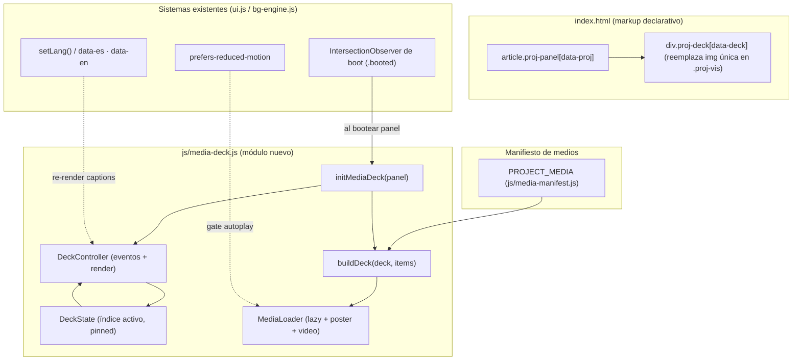
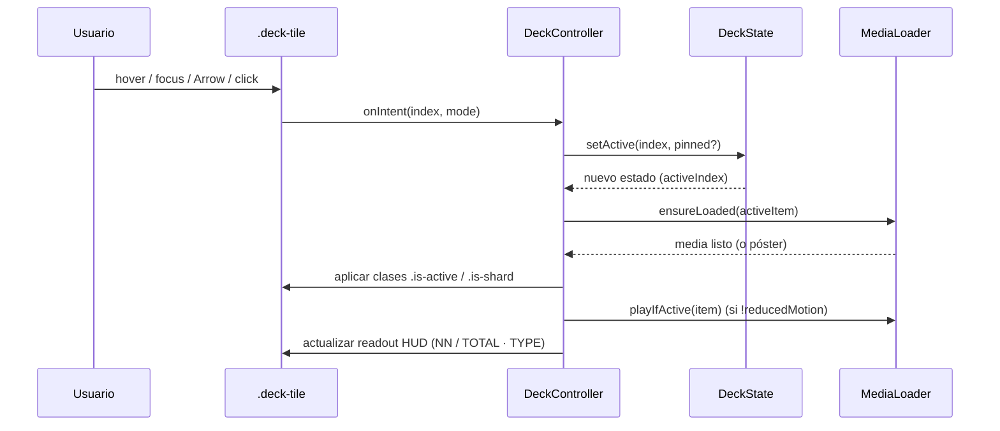

# Documento de Diseño: project-media-showcase

## Overview
<!-- Resumen -->


Hoy cada `article.proj-panel` muestra **una sola imagen estática** dentro de `.proj-vis`. Esta feature
sustituye esa imagen única por una presentación multimedia **interactiva, original y de baja fricción**
capaz de mostrar varias imágenes, GIFs y vídeos por proyecto, sin recurrir a un carrusel clásico
(flechas + un slide visible cada vez).

El concepto elegido es el **"Media Deck": un mosaico HUD que se expande con el foco** (focus-expand
mosaic). En lugar de mostrar un solo medio cada vez, todos los medios del proyecto conviven en un
mosaico fragmentado de estética blueprint/terminal: una pieza es la **activa** (grande) y el resto son
**shards** compactos a su alrededor. Al pasar el cursor (o navegar con teclado) sobre un shard, este se
promueve suavemente a pieza activa mediante una transición de rejilla, con un breve barrido tipo CRT.
Vídeos y GIFs solo se reproducen cuando están activos y si `prefers-reduced-motion` lo permite; en caso
contrario se muestra un póster con un indicador de "play". Un lector HUD muestra el índice actual
(`02 / 05`) y el tipo de medio (`IMG`/`GIF`/`VID`), reforzando el lenguaje de telemetría ya presente.

El diseño es **vanilla JS/CSS con mejora progresiva**, sin framework ni paso de build: se integra con el
`IntersectionObserver` de arranque (`booted`) existente, con el sistema de idioma (`data-es`/`data-en`)
y con el de tema. Los archivos son **placeholders** definidos en un manifiesto de datos por proyecto, con
una convención de nombres clara para que más adelante se sustituyan por los reales. Sin JS, el mosaico
degrada a una rejilla de imágenes desplazable y accesible.

---

## Architecture
<!-- Arquitectura -->




**Principios de integración**

- **Punto de enganche único:** la función de boot existente (`initVis(panel)` se llama tras añadir
  `.booted`) gana una llamada hermana `initMediaDeck(panel)`. No se altera el flujo de
  `IntersectionObserver`, solo se extiende.
- **Mejora progresiva:** el HTML contiene un mosaico estático funcional. `media-deck.js` lo "hidrata"
  añadiendo interactividad. Si el JS falla o está desactivado, el usuario ve igualmente todos los medios.
- **Datos separados de comportamiento:** el manifiesto (`PROJECT_MEDIA`) es un objeto de datos puro;
  el módulo de comportamiento no contiene rutas ni textos hardcodeados.

---

## Diagramas de secuencia

### Arranque e hidratación del deck (integrado con el boot existente)

```mermaid
sequenceDiagram
    participant IO as IntersectionObserver (ui.js)
    participant Panel as .proj-panel
    participant MD as media-deck.js
    participant Man as PROJECT_MEDIA
    participant DOM as .proj-deck

    IO->>Panel: panel entra en viewport
    IO->>Panel: classList.add('booted'); initVis(panel)
    IO->>MD: initMediaDeck(panel)
    MD->>Man: getManifest(panel.dataset.proj)
    Man-->>MD: MediaItem[]
    MD->>DOM: buildDeck(deck, items)  (tiles + readout)
    MD->>DOM: observar tiles para lazy-load (sub-IO)
    MD->>DOM: setActive(0)  (estado inicial)
    Note over MD,DOM: deck queda interactivo (hover/focus/teclado)
```

### Interacción: promover un shard a activo ("tune")



---

## Components and Interfaces
<!-- Componentes e Interfaces -->


### Componente 1: Media Manifest (`js/media-manifest.js`)

**Propósito:** fuente de datos declarativa que asocia cada `data-proj` con su lista ordenada de medios.
Es el único lugar que el usuario edita para añadir/quitar archivos.

**Interfaz (tipos como JSDoc, ejecutables en vanilla JS):**

```javascript
/**
 * @typedef {'image'|'gif'|'video'} MediaType
 *
 * @typedef {Object} MediaItem
 * @property {MediaType} type        - clase de medio
 * @property {string}    src         - ruta al archivo (placeholder por ahora)
 * @property {string}    [poster]    - póster/preview para 'video' (obligatorio si type==='video')
 * @property {string}    [captionEs] - texto descriptivo en español
 * @property {string}    [captionEn] - texto descriptivo en inglés
 * @property {number}    [w]         - ancho intrínseco (opcional, evita layout shift)
 * @property {number}    [h]         - alto intrínseco (opcional)
 *
 * @typedef {Object.<string, MediaItem[]>} MediaManifest  // clave = data-proj
 */

/** @type {MediaManifest} */
const PROJECT_MEDIA = { /* gw: [...], nltl: [...], ... */ };

/**
 * Devuelve la lista de medios de un proyecto, o [] si no existe.
 * @param {string} proj
 * @returns {MediaItem[]}
 */
function getManifest(proj) { /* ... */ }
```

**Responsabilidades:**
- Mantener el orden de presentación (índice 0 = pieza inicial activa).
- Garantizar que cada item tiene `type` y `src` válidos.
- No contener lógica de UI.

### Componente 2: Media Deck (`js/media-deck.js`)

**Propósito:** hidratar `.proj-vis` → `.proj-deck`, construir tiles, gestionar estado e interacción.

**Interfaz:**

```javascript
/**
 * Hidrata el deck de un panel concreto. Idempotente.
 * @param {HTMLElement} panel  - article.proj-panel
 * @returns {DeckController|null}  null si el panel no tiene medios
 */
function initMediaDeck(panel) { /* ... */ }

/**
 * @typedef {Object} DeckController
 * @property {(i:number, opts?:{pinned?:boolean, source?:'hover'|'focus'|'key'|'click'})=>void} setActive
 * @property {()=>number} getActive
 * @property {()=>void} next        // activa el siguiente (wrap)
 * @property {()=>void} prev        // activa el anterior (wrap)
 * @property {()=>void} relabel     // re-renderiza captions tras cambio de idioma
 * @property {()=>void} destroy     // desconecta observers/listeners
 */
```

**Responsabilidades:**
- Construir el DOM del mosaico desde un `MediaItem[]`.
- Gestionar `DeckState` (índice activo, pinned, hover transitorio).
- Coordinar carga perezosa y reproducción condicionada de vídeo/GIF.
- Exponer `relabel()` para que el cambio de idioma actualice textos.

### Componente 3: Media Loader (interno a `media-deck.js`)

**Propósito:** cargar perezosamente cada medio y aplicar la política de reproducción.

**Interfaz:**

```javascript
/**
 * Carga el medio de un tile si aún no se cargó (idempotente).
 * @param {HTMLElement} tile
 * @param {MediaItem} item
 * @returns {Promise<void>}
 */
function ensureLoaded(tile, item) { /* ... */ }

/**
 * Reproduce vídeo/GIF solo si el tile está activo y reduced-motion no está activo.
 * Pausa/segura el resto.
 * @param {HTMLElement} tile
 * @param {MediaItem} item
 * @param {boolean} isActive
 */
function applyPlayback(tile, item, isActive) { /* ... */ }
```

**Responsabilidades:**
- Insertar `` o `<video preload="none" muted playsinline>` bajo demanda.
- Para GIF: cargar solo cuando el tile entra en viewport o se activa (los GIF se animan en cuanto
  cargan, por eso se difiere su `src`).
- Pausar vídeos no activos y respetar `prefers-reduced-motion`.

---

## Data Models
<!-- Modelos de Datos -->


### Modelo: MediaItem y manifiesto

```javascript
// js/media-manifest.js  (placeholders actuales)
const PROJECT_MEDIA = {
  gw: [
    { type: 'image', src: 'public/ph_gw.png',            captionEs: 'Vista general',          captionEn: 'Overview' },
    { type: 'image', src: 'public/media/gw/gw-02.png',   captionEs: 'Grad-CAM',               captionEn: 'Grad-CAM' },
    { type: 'gif',   src: 'public/media/gw/gw-03.gif',   captionEs: 'Inferencia en vivo',     captionEn: 'Live inference' },
    { type: 'video', src: 'public/media/gw/gw-04.mp4',
      poster: 'public/media/gw/gw-04.poster.png',        captionEs: 'Demo de la UI web',      captionEn: 'Web UI demo' }
  ],
  // nltl, cosmos, physdeck, mineralia, mario: misma forma
};
```

**Convención de nombres de archivos (placeholders → reales):**

```
public/media/{proj}/{proj}-{NN}.{ext}        // imágenes y gifs:  gw-02.png, gw-03.gif
public/media/{proj}/{proj}-{NN}.mp4          // vídeo
public/media/{proj}/{proj}-{NN}.poster.png   // póster del vídeo
```

`{proj}` ∈ `{gw, nltl, cosmos, physdeck, mineralia, mario}`; `{NN}` es índice de 2 dígitos (01, 02…).
El índice 0 del array es la pieza activa inicial. Mientras no existan archivos reales, se reutilizan los
`public/ph_*.png` actuales como relleno para todos los slots, de modo que la UI sea visible de inmediato.

**Reglas de validación:**
- `type` ∈ {`image`,`gif`,`video`}; obligatorio.
- `src` no vacío; obligatorio.
- Si `type === 'video'` ⇒ `poster` recomendado (si falta, se usa el primer frame y fondo HUD).
- Un proyecto puede tener entre 1 y N medios. Con 1 medio, el deck degrada a vista única (sin shards).
- `captionEs`/`captionEn` opcionales; si faltan se usa `alt` genérico `"{proj} · {NN}"`.

### Modelo: DeckState (en memoria, por panel)

```javascript
/**
 * @typedef {Object} DeckState
 * @property {MediaItem[]} items
 * @property {number}      activeIndex   // 0..items.length-1
 * @property {boolean}     pinned        // true si el usuario fijó (click/Enter)
 * @property {number}      hoverIndex    // -1 si no hay hover
 * @property {boolean}     reducedMotion // snapshot de la media query
 */
```

**Invariantes de estado:**
- `0 ≤ activeIndex < items.length` en todo momento (nunca fuera de rango).
- `items.length ≥ 1` (si el manifiesto está vacío, el deck no se hidrata).
- Exactamente **un** tile tiene la clase `.is-active`; el resto `.is-shard`.

---

## Estructura HTML (markup base, mejora progresiva)

El HTML de cada `.proj-vis` se sustituye por un contenedor `.proj-deck` que ya es usable sin JS. Ejemplo
para `gw` (el resto análogo):

```html
<div class="proj-vis">
  <div class="proj-deck" data-deck role="group"
       aria-label="Galería del proyecto" aria-roledescription="media deck">
    <!-- Tiles: el primero es la pieza activa inicial. Sin JS se ven como mosaico. -->
    <button class="deck-tile is-active" data-idx="0" type="button" aria-pressed="true">
      
    </button>
    <button class="deck-tile is-shard" data-idx="1" type="button" aria-pressed="false">
      
    </button>
    <!-- ...más tiles (gif/vídeo se inyectan al activarse)... -->
  </div>
  <!-- Lector HUD: índice + tipo (reutiliza el lenguaje .vis-label/.vis-channel) -->
  <div class="deck-readout" aria-hidden="true">
    <span class="deck-idx">01</span><span class="deck-sep">/</span><span class="deck-total">05</span>
    <span class="deck-type">IMG</span>
  </div>
  <!-- Región viva para lectores de pantalla (anuncia el medio activo) -->
  <p class="deck-live sr-only" aria-live="polite"></p>
</div>
```

**Notas de markup:**
- Cada tile es un `<button>` (foco e interacción por teclado nativos; `aria-pressed` indica el activo).
- El `` activo carga con `src`; los shards usan `data-src` y se promueven a `src` al cargar (lazy).
- El esquino HUD `.proj-vis::after` y los acentos `--proj-acc` existentes se mantienen.
- La clase `.sr-only` (a añadir si no existe) oculta visualmente la región `aria-live`.

---

## Enfoque CSS

El mosaico se basa en **CSS Grid** con `grid-template` conmutado por estado, no en `transform`/`scale`,
para que el reflow del foco sea suave y respete el `aspect-ratio` del contenedor.

```css
/* Contenedor: rejilla 3x3 base; la pieza activa ocupa una región mayor */
.proj-deck {
  position: absolute; inset: 0; display: grid; gap: 3px; padding: 3px;
  grid-template-columns: 2fr 1fr 1fr;
  grid-template-rows: 1fr 1fr;
  transition: grid-template-columns .45s cubic-bezier(.2,.7,.2,1);
}
.deck-tile {
  position: relative; overflow: hidden; border: 0; padding: 0; cursor: pointer;
  background: color-mix(in oklab, var(--bg-3) 70%, var(--bg));
  outline-offset: -2px;
}
.deck-tile .deck-media { width:100%; height:100%; object-fit:cover; opacity:0;
  transition: opacity .4s ease, transform .6s cubic-bezier(.2,.7,.2,1); }
.deck-tile .deck-media.loaded { opacity:1; }

/* Pieza activa: abarca la columna ancha + ambas filas */
.deck-tile.is-active { grid-row: 1 / span 2; grid-column: 1; }
.deck-tile.is-shard  { grid-column: 2 / span 2; }  /* repartidos por nth-of-type */

/* Barrido CRT al cambiar de activo (gancho de clase .tuning) */
.proj-deck.tuning .deck-tile.is-active::before {
  content:""; position:absolute; inset:0; z-index:3;
  background: linear-gradient(90deg, transparent, color-mix(in oklab, var(--proj-acc) 35%, transparent), transparent);
  animation: deck-sweep .42s ease;
}

/* Foco visible y estados HUD */
.deck-tile:focus-visible { outline: 1px solid var(--proj-acc, var(--accent)); }
.deck-readout { position:absolute; right:10px; bottom:8px; z-index:4;
  font-family: var(--mono); font-size:9.5px; letter-spacing:.06em;
  color: var(--proj-acc, var(--accent)); pointer-events:none; opacity:.85; }

/* Layout alterno: en paneles pares el activo va a la derecha */
.proj-panel:nth-child(even) .proj-deck { grid-template-columns: 1fr 1fr 2fr; }
.proj-panel:nth-child(even) .deck-tile.is-active { grid-column: 3; }
.proj-panel:nth-child(even) .deck-tile.is-shard  { grid-column: 1 / span 2; }

/* Responsive: bajo 900px, mosaico en tira horizontal scrollable (sin fricción táctil) */
@media (max-width: 900px) {
  .proj-deck { position: relative; grid-template-columns: none;
    grid-auto-flow: column; grid-auto-columns: 72%; overflow-x: auto;
    scroll-snap-type: x mandatory; }
  .deck-tile { scroll-snap-align: center; }
  .deck-tile.is-active, .deck-tile.is-shard { grid-row:auto; grid-column:auto; }
}

/* Reduced motion: sin barrido, sin scale, sin autoplay (gestionado además en JS) */
@media (prefers-reduced-motion: reduce) {
  .proj-deck, .deck-media { transition: none; }
  .proj-deck.tuning .deck-tile.is-active::before { animation: none; }
}
@keyframes deck-sweep { from { transform: translateX(-100%);} to { transform: translateX(100%);} }
```

**Decisiones de diseño CSS:**
- **Grid conmutado** evita superposiciones absolutas frágiles y mantiene el `aspect-ratio: 4/3` del
  `.proj-vis`.
- **Layout alterno** reutiliza el patrón `:nth-child(even)` ya existente para coherencia visual.
- **Móvil** abandona el mosaico por una **tira con scroll-snap** (gesto natural, cero fricción táctil);
  esto no es un carrusel con flechas sino navegación por desplazamiento directo.

---

## Pseudocódigo algorítmico (con especificaciones formales)

### Algoritmo: initMediaDeck

```javascript
function initMediaDeck(panel)
// ENTRADA: panel — HTMLElement article.proj-panel
// SALIDA: DeckController | null
```

**Precondiciones:**
- `panel` no es null y contiene `.proj-vis`.
- `PROJECT_MEDIA` está cargado (script de manifiesto incluido antes que media-deck.js).

**Postcondiciones:**
- Si el proyecto tiene ≥1 medio: `.proj-vis` contiene un `.proj-deck` hidratado con exactamente un
  tile `.is-active`; se devuelve un `DeckController`.
- Si no hay medios: no se modifica el DOM y se devuelve `null`.
- Idempotente: invocar dos veces sobre el mismo panel no duplica tiles ni listeners.

```javascript
function initMediaDeck(panel) {
  ASSERT panel != null
  const proj  = panel.dataset.proj
  const items = getManifest(proj)
  IF items.length === 0 THEN return null

  const vis = panel.querySelector('.proj-vis')
  IF vis.dataset.deckReady === '1' THEN return vis.__deckCtrl   // idempotencia

  const deck = buildDeck(vis, items)        // construye tiles + readout + región aria-live
  const state = { items, activeIndex: 0, pinned: false, hoverIndex: -1,
                  reducedMotion: matchMedia('(prefers-reduced-motion: reduce)').matches }

  const ctrl = createController(panel, deck, state)
  observeTilesForLazyLoad(deck, items)      // sub-IntersectionObserver para shards/gifs
  ctrl.setActive(0, { source: 'init' })     // estado inicial determinista

  vis.dataset.deckReady = '1'; vis.__deckCtrl = ctrl
  return ctrl
}
```

**Invariantes de bucle:** N/A (sin bucles propios; la construcción delega en `buildDeck`).

### Algoritmo: setActive (núcleo de la interacción)

```javascript
function setActive(i, opts)
// ENTRADA: i — índice solicitado; opts.{pinned?, source?}
// SALIDA: void (efecto sobre DOM y state)
```

**Precondiciones:**
- `state.items.length ≥ 1`.
- `i` es un entero (puede venir fuera de rango desde teclado wrap; se normaliza).

**Postcondiciones:**
- `state.activeIndex === normalize(i)` con `0 ≤ activeIndex < items.length`.
- Exactamente un tile tiene `.is-active`; el medio activo está cargado o cargándose.
- Vídeo/GIF del activo se reproduce **solo si** `!state.reducedMotion`; los no activos están pausados.
- El lector HUD y la región `aria-live` reflejan el nuevo índice y tipo.
- Si `opts.source === 'hover'` y `state.pinned === true`, se ignora (un pin no se pisa por hover).

```javascript
function setActive(i, opts = {}) {
  ASSERT state.items.length >= 1
  // 1. Respetar pin frente a hover transitorio
  IF opts.source === 'hover' AND state.pinned THEN return

  // 2. Normalizar índice con wrap (teclado next/prev)
  const n = state.items.length
  const idx = ((i % n) + n) % n

  // 3. Aplicar estado
  const prev = state.activeIndex
  state.activeIndex = idx
  IF opts.pinned === true THEN state.pinned = true
  IF opts.source === 'click' THEN state.pinned = !pinnedTogglesSame(prev, idx)

  // 4. Reflejar en DOM con invariante "un solo activo"
  FOR each tile, k IN deck.tiles DO
    const isActive = (k === idx)
    tile.classList.toggle('is-active', isActive)
    tile.classList.toggle('is-shard', !isActive)
    tile.setAttribute('aria-pressed', String(isActive))
    INVARIANT: count(tiles with .is-active) === 1   // se mantiene tras el bucle
  END FOR

  // 5. Cargar y reproducir según política
  ensureLoaded(deck.tiles[idx], state.items[idx])
  FOR each tile, k IN deck.tiles DO
    applyPlayback(tile, state.items[k], k === idx)   // pausa no-activos; play si activo y !RM
  END FOR

  // 6. Transición CRT y readout
  IF prev !== idx AND !state.reducedMotion THEN triggerSweep(deck)
  updateReadout(deck, idx, state.items[idx].type)
  announce(deck, idx, state.items[idx])              // aria-live polite
}
```

**Invariantes de bucle:**
- Tras el paso 4, el número de tiles con `.is-active` es exactamente 1.
- En el paso 5, todo tile distinto del activo queda pausado/seguro antes de salir.

### Algoritmo: ensureLoaded (carga perezosa)

```javascript
function ensureLoaded(tile, item)
// SALIDA: Promise<void>
```

**Precondiciones:** `tile` existe; `item.type` ∈ {image,gif,video}; `item.src` no vacío.

**Postcondiciones:**
- El elemento de medio correcto existe en el tile (`` o `<video>`), con su `src` real asignado.
- Llamadas repetidas no recrean el medio (idempotente vía `tile.dataset.loaded`).
- No lanza ante 404; aplica fallback visual (clase `.media-error` + póster/acento).

```javascript
function ensureLoaded(tile, item) {
  IF tile.dataset.loaded === '1' THEN return Promise.resolve()
  SWITCH item.type
    CASE 'image':
    CASE 'gif':
      const img = tile.querySelector('img.deck-media') OR createImg(tile)
      img.src = item.src                       // promueve data-src → src
      onload  → img.classList.add('loaded')
      onerror → tile.classList.add('media-error')
    CASE 'video':
      const v = createVideo(tile, { muted:true, playsinline:true, preload:'none',
                                    poster: item.poster })
      v.src = item.src
      onerror → tile.classList.add('media-error')
  END SWITCH
  tile.dataset.loaded = '1'
  return loadedPromise
}
```

**Invariantes de bucle:** N/A.

### Algoritmo: applyPlayback (política de reproducción)

```javascript
function applyPlayback(tile, item, isActive)
```

**Precondiciones:** `tile` e `item` válidos; `state.reducedMotion` es un booleano.

**Postcondiciones:**
- Si `item.type === 'video'`: reproduce sii (`isActive ∧ ¬reducedMotion`); en otro caso `pause()`.
- Si `item.type === 'gif'`: si `reducedMotion`, el `src` permanece sin asignar (no anima) salvo que el
  usuario lo active explícitamente; si activo y `¬reducedMotion`, se carga el gif.
- `image` no se ve afectada.

```javascript
function applyPlayback(tile, item, isActive) {
  IF item.type === 'video' THEN
    const v = tile.querySelector('video')
    IF v == null THEN return
    IF isActive AND NOT state.reducedMotion THEN
      v.play().catch(noop)        // autoplay muted permitido; si falla, queda póster
    ELSE
      v.pause()
    END IF
  ELSE IF item.type === 'gif' THEN
    IF isActive AND NOT state.reducedMotion THEN ensureLoaded(tile, item)
    // si reducedMotion: se muestra primer frame estático (data-src sin promover)
  END IF
}
```

---

## Funciones clave con especificaciones formales

| Función | Firma | Precondición | Postcondición |
|---|---|---|---|
| `getManifest` | `(proj:string) => MediaItem[]` | `proj` es string | devuelve array (posiblemente vacío); nunca null |
| `buildDeck` | `(vis:HTMLElement, items:MediaItem[]) => Deck` | `items.length ≥ 1` | crea N tiles + readout + región aria-live; primer tile `.is-active` |
| `initMediaDeck` | `(panel:HTMLElement) => DeckController\|null` | panel con `.proj-vis` | deck hidratado e idempotente, o null sin medios |
| `setActive` | `(i:number, opts?) => void` | `items.length ≥ 1` | exactamente un activo; índice en rango; playback correcto |
| `ensureLoaded` | `(tile, item) => Promise<void>` | item válido | medio cargado una sola vez; fallback ante error |
| `applyPlayback` | `(tile, item, isActive) => void` | `reducedMotion` booleano | play sii activo y sin reduced-motion; resto pausado |
| `relabel` | `() => void` | controlador inicializado | captions/aria según `documentElement.dataset.lang` |
| `destroy` | `() => void` | — | observers/listeners desconectados; sin fugas |

---

## Ejemplo de uso

```javascript
// 1) En ui.js, dentro del IntersectionObserver de boot ya existente:
const pio = new IntersectionObserver(entries => entries.forEach(e => {
  if (!e.isIntersecting) return;
  const panel = e.target;
  const fill = panel.querySelector('.proj-boot-fill');
  if (fill) requestAnimationFrame(() => { fill.style.width = '100%'; });
  setTimeout(() => {
    panel.classList.add('booted');
    initVis(panel);
    initMediaDeck(panel);          // ← NUEVO: hidrata el deck al bootear el panel
  }, 440);
  pio.unobserve(panel);
}), { threshold: 0, rootMargin: '0px 0px -10% 0px' });

// 2) Al cambiar de idioma (en setLang de bg-engine.js), re-etiquetar los decks:
document.querySelectorAll('.proj-vis').forEach(v => v.__deckCtrl?.relabel());

// 3) Interacción declarativa (delegación dentro del deck):
//    hover  → setActive(idx, { source:'hover' })   (no pisa un pin)
//    focus  → setActive(idx, { source:'focus' })
//    click  → setActive(idx, { source:'click' })   (alterna pin)
//    ←/→    → ctrl.prev() / ctrl.next()             (wrap)
```

---

## Correctness Properties
<!-- Propiedades de Correctitud -->


For todo panel `p` con manifiesto `items` (|items| ≥ 1) y toda secuencia de interacciones:

### Property 1: Exactamente un activo

∀ estado alcanzable, `count({ t ∈ tiles(p) : t tiene .is-active }) = 1`.

### Property 2: Índice en rango

∀ estado, `0 ≤ activeIndex < |items|` (incluido tras `next`/`prev` con wrap).

### Property 3: Wrap correcto

`next()` aplicado en `activeIndex = |items|−1` ⇒ `activeIndex = 0`; `prev()` en `0` ⇒ `|items|−1`.

### Property 4: Política de movimiento

∀ item de tipo `video`/`gif`, reproduce ⇔ (`es el activo` ∧ `¬prefers-reduced-motion`). Ningún medio no
activo está en reproducción.

### Property 5: Pin estable

Si `pinned = true`, ningún evento `hover` cambia `activeIndex` (solo `click`, teclado o un nuevo pin).

### Property 6: Idempotencia de hidratación

`initMediaDeck(p)` invocado k≥1 veces produce el mismo DOM que una sola invocación (sin tiles ni
listeners duplicados).

### Property 7: Carga única

∀ tile, el medio se carga a lo sumo una vez (`ensureLoaded` idempotente).

### Property 8: Mejora progresiva

Sin JS, ∀ medio del manifiesto es alcanzable visualmente (mosaico/tira) y navegable por teclado vía
botones nativos.

### Property 9: Sincronía de idioma

Tras `relabel()`, todo caption/aria-label coincide con `documentElement.dataset.lang`.

---

## Error Handling
<!-- Manejo de Errores -->


| Escenario | Condición | Respuesta | Recuperación |
|---|---|---|---|
| Archivo de medio 404 | `img.onerror` / `video error` | añadir `.media-error`, mostrar fondo HUD + acento del proyecto + tipo | el tile sigue siendo navegable; no rompe el deck |
| Proyecto sin entrada en manifiesto | `getManifest` devuelve `[]` | `initMediaDeck` devuelve `null`; se conserva el markup base | usuario ve el/los `` estáticos existentes |
| `autoplay` bloqueado por el navegador | `video.play()` rechaza | `.catch(noop)`: se mantiene el póster visible | usuario puede activar con click/Enter |
| `prefers-reduced-motion` activo | media query = reduce | sin autoplay, sin barrido CRT, sin scale | controles manuales siguen disponibles |
| JS desactivado / error de carga | sin hidratación | mosaico estático con `loading="lazy"` | navegación nativa por scroll/teclado |
| Manifiesto malformado (item sin `src`) | validación en `buildDeck` | se omite el item inválido y se registra `console.warn` | el resto del deck funciona |

---

## Testing Strategy
<!-- Estrategia de Pruebas -->


### Pruebas unitarias

- `getManifest`: devuelve `[]` para proyecto inexistente; array correcto para válido.
- `normalizeIndex`/wrap: `next`/`prev` mantienen rango y hacen wrap en extremos.
- `setActive`: tras invocar con varios índices, siempre hay exactamente un `.is-active`.
- Política de pin: `hover` no cambia activo cuando `pinned`.
- `ensureLoaded`: segunda invocación no recrea el medio (`tile.dataset.loaded`).

### Pruebas basadas en propiedades (Property-Based Testing)

**Librería propuesta:** `fast-check` (JS, sin build; ejecutable con un runner ligero como `node --test`
o abierto en página de test). Generadores: secuencias aleatorias de acciones
`{hover i, focus i, click i, next, prev}` sobre un deck con |items| aleatorio (1..8).

Propiedades a verificar (mapean 1:1 con la sección Correctitud):
- **P1 invariante de activo único** se mantiene tras cualquier secuencia de acciones.
- **P2 índice en rango** se mantiene tras cualquier secuencia (incluye wrap).
- **P4 política de movimiento**: ningún tile no activo reproduce; el activo reproduce sii `¬RM`.
- **P5 pin estable**: bajo `pinned`, los `hover` no alteran `activeIndex`.
- **P6 idempotencia**: `initMediaDeck` ×k ≡ `initMediaDeck` ×1 (mismo recuento de tiles/listeners).

### Pruebas de integración

- Boot: al hacer scroll a un panel, `.booted` ⇒ deck hidratado y primer medio cargado.
- Idioma: `setLang('en')` ⇒ captions/aria en inglés en todos los decks (`relabel`).
- Responsive: bajo 900px el deck es una tira con `scroll-snap`; sin solapes de grid.
- Accesibilidad: navegación Tab entre tiles, `aria-pressed` correcto, anuncios `aria-live`.

---

## Consideraciones de Rendimiento

- **Carga perezosa estricta:** solo el medio activo (índice 0) carga al bootear; shards usan `data-src`
  + `loading="lazy"` y un sub-`IntersectionObserver`. Vídeos con `preload="none"`.
- **Sin layout shift:** `aspect-ratio` heredado del `.proj-vis` + `w/h` opcionales en el manifiesto.
- **GIF bajo demanda:** los GIF solo asignan `src` al activarse (evita decodificación de varios GIF a la vez).
- **Transición por grid-template:** animar `grid-template-columns` es barato y compositable; se evita
  reflujo de imágenes pesadas.
- **Reutilización de observers:** un único sub-observer por deck; `destroy()` los desconecta.
- **Compatibilidad con boot existente:** la hidratación ocurre tras `.booted`, fuera del camino crítico
  de pintado inicial.

## Consideraciones de Seguridad

- El manifiesto es **estático y local** (sin entrada de usuario), por lo que no hay riesgo de inyección
  desde datos externos. Aun así, los textos de caption se insertan vía `textContent`/atributos, no
  `innerHTML`, evitando XSS si en el futuro provienen de una fuente dinámica.
- `src` se restringe a rutas relativas dentro de `public/media/`; documentar que no se acepten URLs
  remotas arbitrarias sin revisión.
- Vídeos `muted playsinline` para evitar reproducción intrusiva.

## Accesibilidad

- Tiles como `<button>` con foco nativo, `aria-pressed`, y `role="group"`/`aria-roledescription` en el
  contenedor.
- Región `aria-live="polite"` anuncia "Medio N de TOTAL: caption".
- `:focus-visible` con el acento del proyecto; navegación con Tab y flechas.
- Respeto total de `prefers-reduced-motion` (sin autoplay ni barridos).
- Texto alternativo por medio (`captionEs/En` o `alt` generado).

## Dependencias

- **Ninguna nueva en runtime.** Vanilla JS/CSS/HTML, sin framework ni paso de build.
- Archivos nuevos: `js/media-manifest.js` (datos) y `js/media-deck.js` (comportamiento), cargados antes
  del `initHero()`/boot en el orden de `<script>` de `index.html`.
- Para PBT (solo desarrollo): `fast-check` ejecutado en una página de test o con un runner Node; no se
  incluye en la página de producción.
- Reutiliza variables CSS existentes (`--proj-acc`, `--mono`, `--rule`, etc.) y el patrón
  `:nth-child(even)` de layout alterno.
